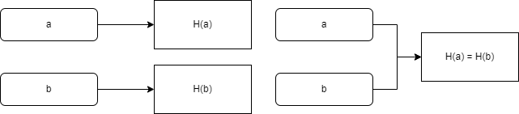
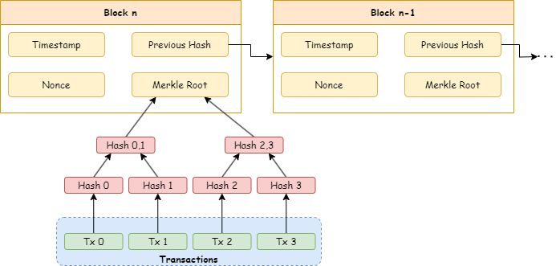
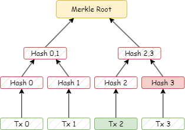

# Hash Functions

A hash function is a mathematical function that takes a variable-length string as input and maps it to a fixed-length string. Besides that, a hash function is unidirectional and should be efficient. We consider efficient as O(n) where n is the input size. A simple hash function would be the remainder of the division of the input length by the desired output size, such as 13.

However, hash functions suffer from two problems in cryptography. The first is collisions, since we are mapping an infinite universe (all the possible inputs) into a finite universe (fixed-length output), some inputs will be hashed into the same value, as the figure below illustrates. In our simple hash example, any two inputs with the same length would have the same hash, for instance.



The second problem is that we can infer the input, even though hash functions are unidirectional, if the input options are limited. Imagine that for some application, the input options are only head or tail. Given that hash functions are also efficient, anyone can calculate hash(head) and hash(tail) to determine which one was used as input.

Try out the `simple_hash.py` program to see a hash function in practice. In the next section, we explore Cryptographic Hash Functions, a special group of hash functions.

## Cryptographic Hash Functions
Cryptographic Hash Functions are a special class of hash functions that have three important properties: Collision-Resistance, Hiding, and Puzzle Friendliness. Each one of them and its applications are detailed in the following subsections.

### Collision-Resistance
> A collision-resistant hash function is a function for which it is infeasible to find two values x and y with x != y, where H(x) = H(y).

One application is Message Digest, as the outputs of a hash function have a fixed size, allowing for the summarization of much larger inputs, and the collision-resistant property ensures that messages (inputs) will have different summaries (outputs).

### Hiding
> A hash function H is said to be hiding if when a secret value r is chosen from a probability distribution that has high min-entropy, then. given H(r || x), it is infeasible to find x.

The application of the hiding property is the case of a limited input universe. We can use the value r concatenated with the original input x to create an infinite input option set, and, therefore, make it impossible to brute force the input from the output value.

### Puzzle Friendliness
> A hash function H is said to be puzzle-friendly if for every possible n-bit output value y, if k is chosen from a distribution with high min-entropy, then it is infeasible to find x such that H(k || x) = y in time significantly less than 2ⁿ.

This property is what allows the Proof of Work consensus algorithm to function correctly. The mining process in the algorithm involves finding a nonce value k that, when hashed, as with SHA-256, the output starts with a certain number of zero bits. Note that the output y governs the difficulty of the mining/puzzle, and it is exponential according to the property.

## Hash Functions and Blockchain
But what is inside the block? It depends. For instance, Bitcoin's block consists of: Timestamp, Nonce, Previous Block Hash, and Merkle Root. From this list, the least intuitive ones are nonce and Merkle Root. Nonce is the value discovered by the miner (it is the k mentioned in the puzzle-friendliness property). Merkle Root is a summary of the transactions that were grouped into that block. This summary is created using a Merkle tree, which is a binary tree implemented using hash pointers. In this tree, the value of a parent node, suppose v0,1, is given by the hash of the sum of its children, v0 and v1, represented by the expression v0,1 = hash(v0||v1). The figure below showcases how the blocks are organized.



Ethereum, on the other hand, utilizes a more complex block structure. Each Ethereum block has three Merkle root hashes: Transactions, Receipts (essentially, pieces of data showing the effect of each transaction), and State.

## Practical Exercises
This section presents practical exercises that complement the reading.

### Simple Hash Function
The `./exercises/simple_hash/simple_hash.py` script implements the simple hash mentioned in this doc. Update the code to construct a Hash Table (python dict) using the simple hash and play around with it to find a collision.


### Cryptographic Hash Function
The `./exercises/cryptographic_hash/cryptographic_hash.py` script utilizes SHA-256 (a cryptographic hash function used by Bitcoin) to do the hashing. Update the code to construct a Hash Table (Python dict) using the cryptographic hash and observe that collisions will no longer happen.

### Merkle Trees
This exercise is divided into two parts, represented by the merkleize and validate_proof functions declared in the `./exercise_merkle_tree/merkle.py`. The objective is to implement these two functions. Consider a binary Merkle Tree for the exercise.

Part 1's objective is to implement the merkleize function. The merkleize function should calculate the Merkle Root Hash of the an string received as input. Consider each block is a word in the sentence (not including spaces, but including punctuation).

Since we are working with binary Merkle trees, you will need to add padding if the blocks are not a power of 2. For Merkle tree padding, you will be using the 0 byte. (Literally '\x00' or chr(0) in Python.) Note: do not use the HASH of the 0 byte, as though the 0 byte were a block of data—this would make the hash of padded data indistinguishable from the hash of the same data with a bunch of 0s appended to it.

Part 2's objective is to implement the validate_proof function. This verification aims to verify that a given data (leaf of the tree) exists. Due to how a Merkle Tree is organized, you don't need the whole tree to prove that some data belongs to it. To prove the data, we only need the sibilings along the way and the root hash, because we can recalculate and rebuild that portion. This proof is called Merkle Proof or Merkle Path. The figure below shows a Merkle Path to prove Tx 2 belongs to the tree.



To verify a Merkle proof, we need the root, the block of data for which we're proving inclusion, and all of the siblings on the way up the Merkle proof. We also need to know which side each sibling is on. Otherwise, we won't know which to concatenate on which side.

Our function will receive the Merkle root, the data for which we're proving inclusion, and then a list of tuples of sibling hashes:
```
[(sibling_hash, Side.LEFT or Side.RIGHT), (sibling_hash, Side.LEFT or Side.RIGHT), ...]
```

Knowing which sides they're on is necessary for the correct concatenation order as you're reconstructing the Merkle path. Utilize the `exercise_merkle_tree/merkle_test.py` to validate your implementation. The test file might also be helpful to understand the hashing.

## References
1. Narayanan, Arvind, et al. Bitcoin and cryptocurrency technologies: a comprehensive introduction. Princeton University Press, 2016
1. Nakamoto, Satoshi. "Bitcoin: A peer-to-peer electronic cash system." (2008).
1. https://blog.ethereum.org/2015/11/15/merkling-in-ethereum?ref=nakamoto.com
1. https://balajis.com/p/merkle-trees
1. https://docs.python.org/3/library/hashlib.html